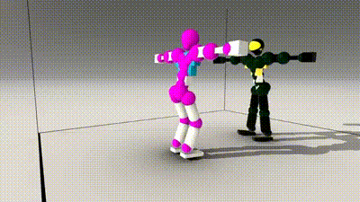
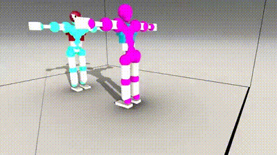
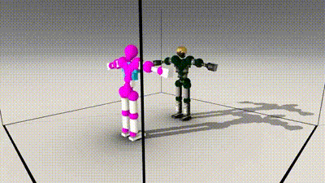
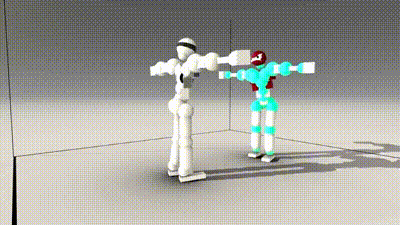

# TORIBASH FreeStyle (TBFS 1.0)
A TORIBASH mod exploring new avenues for competitive gameplay.

**Striking Specialist Advantages:**
 - No out-of-ring DQ (ring surrounded by walls) 
 - No in-ring DQ 
 - Early and mid-game turn frames have high movement flexibility 

**Grappling Specialist Advantages:**
 - Grabs enabled 
 - Aikido Big Dojo gravity settings 
 
**Neutral Advantages:**
 - Decaps included 
 - Dismemberments included 
 - Fractures included 
 - Aikido Big Dojo point system 
 - Increased engage distance

**Environment Design Philosophy:**
 - Minimalistic (simple and trimmed geometry) 
 - Optimized (should run at 60 fps on most hardware) 

**Realtime Match Length (1000 frames / 23 turns / 20-second reaction time):**
 - 1 Match - ~7 mins 
 - Top 8 - ~1 hr 
 - Top 16 - ~2 hrs 
 - Top 24 - ~3 hrs 
 - Top 32 - ~4 hrs 
